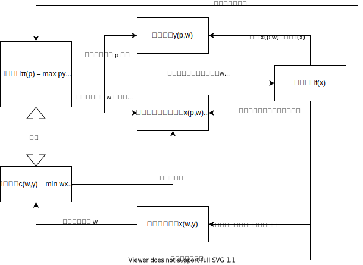
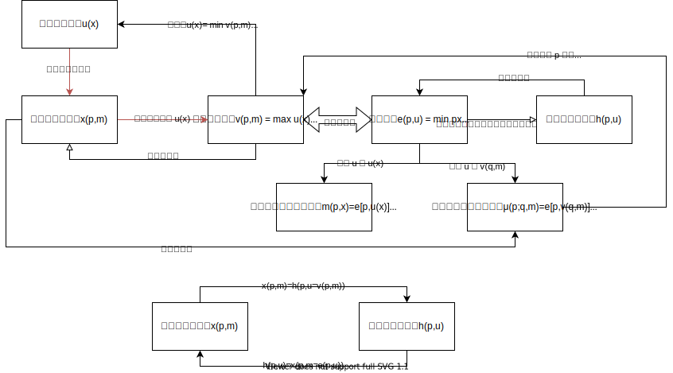

# Microeconomics

# 生产者行为

## 技术

### 生产计划

 使用 $R^n$ 上的向量 $\mathbf{y}$ 来同时表示一个生产计划的投入与产出，其中投入与产出所处的分量位置一般由具体情况约定。例如使用一瓶水、一包面粉做成一个面包，可以记为 $(1,-1,-1)$，具体位置为 $(\text{面包，水，面粉})$ 。**负数为净投入，正数为净产出**。

### 生产可能集

用 $R^n$ 上的子集 $\mathbf{Y}$ 来表示生产可能集（不一定是严格意义上的子空间）。短期受限的生产可能集表示为 $\mathbf{Y}(z)$，如 $\mathbf{Y}(\bar{y_n})=\{\mathbf{y}\ in\ \mathbf{Y},y_n=\bar{y_n}\}$

### 要素需求集

$$
\begin{align}
V(y) &= \{\mathbf{x}\in R^{n}_{+},(y,\mathbf{-x})\text{ is in}\ \mathbf{Y} \}\\
&= \{\mathbf{x}:f(\mathbf{x})\geq y\}
\end{align}
$$

要素需求集就是**至少**可以生产出 $y$ 个单位产出的要素投入集合。注意这里的要素投入用正数来表示，在生产计划和生产可能集中要素投入则是负数。**不止一种产出时可能用要素需求及来表示技术，而非生产函数**

对技术通常可以有以下三个假设：

1. **单调的技术**：如果 $\mathbf{x}\in V(y)$，并且 $\mathbf{x}'\geq \mathbf{x}$，那么 $\mathbf{x}'\in V(y)$。也就是说更多的投入肯定不会降低原来的产量，隐含弃置免费
2. **凸技术**：$V(y)$ 是凸集。另外再有两个命题
   1. 凸生产集 $\mathbf{Y}$ 意味着凸投入要求集 $V(y)$
   2. 凸投入要求集 $V(y)$ 等价于拟凹生产函数 $f(\mathbf{x})$
3. **正则（Regular）的技术** ：对所有的 $y\geq 0$，$V(y)$ 是一个非空的闭集。非空也就是说总是有某个可能的方法可以生产出任意给定水平的产出，闭集是个无伤大雅的假设。
   1. 反过来说，如果能找到某些水平的 $y$ 是没有办法生产出来的，那这个技术就不是正则的

如果对于有不同的技术可用于生产同一种产品，称为不同的**“活动”**：比如甲技术用 $(x_A,2x_B)$ ，乙技术用 $(2x_A,x_B)$ 都可以生产 $y$ 个产出，那么可以写成 $V(y)=\{(X_A+2X_B,2X_A+X_B):y=y_甲+y_乙\}$ 。要具体确定成本函数时，详见成本最小化与成本函数一节

### 生产函数

只有一种产出时使用
$$
f(\mathbf{x})=\{y\in R:(y,-\mathbf{x})\in Y,且\ y\ 是最大产出\}
$$

**位似生产技术**

通过位似函数来做出一个”看起来像“规模收益不变的生产技术，$f(\mathbf{x})=g(h(\mathbf{x}))$ ，其中 $h(\cdot)$ 是一次齐次，$g(\cdot)$ 是单调函数。可以证明

- 若有 $f(\mathbf{x})=f(\mathbf{x'})$，则有 $f(t\mathbf{x})=f(t\mathbf{x'})$
- 技术替代率 TRS 与生产规模无关

### 等产量线

$$
Q(y)=\{\mathbf{x}\in R^n_+:\mathbf{x}\in V(y) 且对于任意的 y'\gt y,\mathbf{x}\notin V(y')\}
$$

等产量线描述了所有**恰好**生产 $y$ 单位产出的投入束

### 技术替代率 TRS

保持产量不变时，投入要素之间的替代率。可以由全微分所得，**注意为负数**
$$
\frac{dx_2}{dx_1}=-\frac{\partial f/\partial x_1}{\partial f/\partial x_2}
$$

### 替代弹性

$$
\begin{align}
\sigma &= \frac{d(x_2/x_1)}{x_2/x_1}/\frac{dTRS}{TRS}\\
&= \frac{dln(x_2/x_1)}{dln|TRS|}
\end{align}
$$

### 规模收益

**规模收益不变**：三种等价表述

**规模收益递增**：**对于所有的 $t>1$**， $f(t\mathbf{x})\gt tf(\mathbf{x})$

**规模收益递减**：**对于所有的 $t>1$**， $f(t\mathbf{x})\lt tf(\mathbf{x})$

### 规模弹性

$$
e(\mathbf{x})=\left.\frac{dy(t)/y(t)}{dt/t}\right|_{t=1}=\left.\frac{df(t\mathbf{x})}{dt}\frac{t}{f(t\mathbf{x})}\right|_{t=1}
$$

必须算出 $t=1$ 处的值，以计算在点 $\mathbf{x}$ 处的规模弹性。从而看是局部递增/不变/递减

## 利润最大化与利润函数

<b>生产者行为各主要函数关系</b>

### 利润函数

目前只考虑竞争性企业，也就是上下游的价格都是外生给定的。
$$
\pi(\mathbf{p})=max \ \mathbf{p}\mathbf{y}\\
s.t. \quad \mathbf{y}\in\mathbf{Y}
$$
利润函数已经为最优化状态。这里的 $\mathbf{p}$ 视为行向量，$\mathbf{y}$ 视为列向量，进而利润即成为内积形式的。**同时 $\mathbf{p}$ 包括了要素价格，因为 $\mathbf{y}$ 中要素投入以负数表示，也就符合了利润的形式。后续要留意符号上 $\mathbf{p}$ 和 $\mathbf{w}$ 一般不会同时在场， $\mathbf{p}$ 混合了产品价格和要素价格**

如果只考虑一种产品，则可以用生产函数表述
$$
\pi(p,\mathbf{w}) = max \ pf(\mathbf{x})-\mathbf{w}\mathbf{x}
$$
现在 $p$ 是这唯一一种产品的标量价格（不再是向量了），$\mathbf{w}$ 则是从原来的 $\mathbf{p}$ 中分离出来单独表示的要素价格向量

二阶条件要求生产函数的黑塞矩阵为半负定。**注意这里利润最大化的要求是无约束半负定，和成本最小化的要求不一样**

**性质** （而且也是充分条件，保证可以通过对偶找到对应的技术函数）：

1. 关于产出价格非减，关于投入价格非增
2. 关于 $\mathbf{p}$ 一次齐次
3. 关于 $\mathbf{p}$ （不严格）凸，即 $\pi$ 对 $\mathbf{p}$ 的黑塞矩阵半正定。**注意利润都是求最大化，但却是凸的**
4. 关于 $\mathbf{p}$ 连续

**可能存在的问题**

- 技术不可微：如 leontief 函数
- 可能没有内点解而是角点解、边界解：KT 条件
- 可能不存在利润最大化的生产计划：如规模收益不变，无限扩大
- 利润最大化生产计划可能不止一个：如规模收益不变

**替代矩阵**

描述厂商随着要素价格的改变如何用一种投入替代另一种投入。通过利润最大化一阶条件两边再继续对要素价格微分所得
$$
\begin{pmatrix}
\dfrac{\partial{x_1}}{\partial{w_1}}&\dfrac{\partial{x_1}}{\partial{w_2}}\\
\dfrac{\partial{x_2}}{\partial{w_1}}&\dfrac{\partial{x_2}}{\partial{w_2}}
\end{pmatrix}
=
\begin{pmatrix}
f_{11}&f_{12}\\
f_{21}&f_{22}
\end{pmatrix}^{-1}
$$
因为严格利润最大化的二阶条件就是生产函数的黑塞矩阵严格负定，所以替代矩阵作为其逆矩阵也是对称负定的（黑塞矩阵本身就对称）

- 主对角线各项为负，需求定律
- 对称性：当物品 $j$ 的价格变动时，厂商对物品 $i$ 的需求变动必然等于当物品 $i$ 价格变动时厂商对物品 $j$ 的需求变动

### 成本函数

从价格向量 $\mathbf{p}$ 中显式分离出要素价格向量 $\mathbf{w}$ 后，可以表示为
$$
c(\mathbf{w},y)=min\ \mathbf{wx}\\
s.t.\ \mathbf{x}\in V(y)
$$

更多细节见成本最小化与成本函数部分

### 霍特林引理 Hotelling's lemma

可用于从利润函数推出供给、需求函数
$$
y_i(\mathbf{p})=\frac{\partial \pi(\mathbf{p})}{\partial p_i}\quad i=1,2,\cdots,n\\
-x(p,w)=\frac{\partial\pi}{\partial w}
$$

### 供给函数

给定上下游价格，最优供给产品量

注意这里的符号，隐含了只有单个产品。如果只把 $\mathbf{p}$ 理解为产品价格而非混合上了要素价格，那么写成粗体向量应该也是没问题的
$$
y(p,\mathbf{w})=f[\mathbf{x}(p,\mathbf{w})]
$$
通过霍特林引理（Hotelling's lemma），可以从利润函数推出净供给函数

**这里的 $\mathbf{p}$ 包含了要素价格，所以 $y$ 中的分量也有要素需求**
$$
y_i(\mathbf{p})=\frac{\partial\pi(\mathbf{p})}{\partial p_i}\quad i=1,\cdots,n
$$

**性质** （而且也是充分条件，保证可以通过对偶找到对应的技术函数）：

1. 考虑霍特林引理的导数关系，净供给的符号正负正好符合利润函数的关于产出价格非减，关于投入价格非增

2. 关于 $\mathbf{p}$ 零次齐次。对应利润函数一次齐次

3. 利润函数是关于 $\mathbf{p}$ （不严格）凸函数，因为霍特林引理 $\pi$ 对 $\mathbf{p}$ 的二阶导数等于供给 $\mathbf{y}$ 对 $\mathbf{p}$ 的一阶导数，下面等式右边正是供给替代矩阵，也是半正定的
   $$
   \begin{pmatrix}
   \dfrac{\partial^2 \pi}{\partial p_1^2}&\dfrac{\partial^2 \pi}{\partial p_1p_2}\\
   \dfrac{\partial^2 \pi}{\partial p_2p_1}&\dfrac{\partial^2 \pi}{\partial p_2^2}
   \end{pmatrix}
   =
   \begin{pmatrix}
   \dfrac{\partial{y_1}}{\partial p_1}&\dfrac{\partial{y_1}}{\partial p_2}\\
   \dfrac{\partial{y_2}}{\partial p_1}&\dfrac{\partial{y_2}}{\partial p_2}
   \end{pmatrix}
   $$
   

### （无条件）要素需求函数

给定上下游价格，最优要素需求量

**注意这里的符号，隐含了只有单个产品**。如果只把 $\mathbf{p}$ 理解为产品价格而非混合上了要素价格，那么写成粗体向量应该也是没问题的
$$
\mathbf{x}(p,\mathbf{w})
$$

通过霍特林引理（Hotelling's lemma），可以从利润函数推出需求函数

**以下为符号上明确区分产品价格 $p$ 和要素价格 $w$ 的情况，不同于上面 $\mathbf{p}$ 的混合情况**
$$
-x_i(p,w)=\frac{\partial{\pi}}{\partial{w}}
$$
**注意负号**：增加投入的价格，利润是下降的

**性质**（注意是成本函数从谢泼德路线推导的思路，不是利润函数霍特林路线的思路；而且也是充分条件，保证可以通过对偶找到对应的技术函数）：

1. 需求大于等于零，对应成本函数是要素价格的非减函数，一阶导数大于等于零
2. 关于 $\mathbf{w}$ 零次齐次。对应成本函数一次齐次
3. 要素需求函数的雅克比矩阵为半负定，对应成本函数为（不严格）凹函数，其黑塞矩阵为半负定。
   1. 交叉价格效应对称
   2. 自价格效应非正
   3. 要素需求变动向量和要素价格变动向量反方向移动

### 条件要素需求函数

$$
x(\mathbf{w},y)\\
对比无条件要素需求，变量加入了 y
$$

另有恒等式
$$
x_i[\mathbf{w},y(p,\mathbf{w})]=x_i(p,\mathbf{w})
$$

## 成本最小化与成本函数

在要素价格 $\mathbf{w}$ 和产出水平 $y$ 下的最小成本
$$
min\ \mathbf{wx}\\
s.t.\ f(\mathbf{x})=y\\
约束条件或写为 s.t.\ \mathbf{x}\in V(y)
$$
即
$$
c(\mathbf{w},y)=\mathbf{wx}(\mathbf{w},y)
$$
也就是条件要素需求 $\mathbf{x}(\mathbf{w},y)$ 乘上要素价格 $\mathbf{w}$

二阶条件要求生产函数的黑塞矩阵为**约束下**半负定。**注意这里成本最小化下的半负定为有约束，和利润最大化部分不一样。**

**性质** （再加上非负性就是成本函数的充分条件，保证可以通过对偶找到一个对应的技术函数）：

1. 关于 $\mathbf{w}$ 非减
2. 关于  $\mathbf{w}$ 一次齐次，相应的要素需求 $\mathbf{x}(\mathbf{w},y)$ 关于 $\mathbf{w}$ 零次齐次
3. 关于 $\mathbf{w}$ （不严格）凹函数。**注意成本都是求最小化，但却是凹的**
4. 对于 $\mathbf{w}\gg0$，$c(\mathbf{w},y)$ 关于 $\mathbf{w}$ 连续

 **可能存在的问题**：

- 生产函数可能不可微：如 Leontief 函数
- 边界角点解问题：KT 条件修正
- 不像利润最大化的存在性问题，**一般不存在**成本最小化存在性问题：连续函数有界闭集（紧集）一定有最值
- 一阶条件不能唯一确定成本最小化选择：需要加强假设 $V(y)$ 为凸集

**替代矩阵**

从成本最小化推导的要素需求替代矩阵过程更复杂一些，但结论大体和利润最大化中推导的一致：交叉价格效应一定相等

**规模收益不变的技术对应的成本函数**

如果**生产函数**显示出规模收益不变（可以是位似形式），那么**成本函数**应该有 $c(\mathbf{w}, ty)=tc(\mathbf{w},y)$ ，令 $t=y，y=1/t$，也就有 $c(\mathbf{w},y)=yc(\mathbf{w},1)$。可将 $y$ 单独分离的形式。反过来也是正确的，只要成本函数满足上面等式，生产技术也就有规模收益不变。也可同时推出条件要素需求 $x(\mathbf{w},y)=yx(\mathbf{w},1)$ 的可分形式

**成本最小化弱公理（WACM）**

观察到的投入选择的成本不应该高于可以生产至少同样多产出的任何其他水平的投入成本
$$
\mathbf{w}^t\mathbf{x}^t\leq\mathbf{w}^t\mathbf{x}^s\ 对所有满足 y^s\geq y^t 的 s 和 t 成立\\
应该还有\mathbf{w}^t\mathbf{x}^t\leq\mathbf{w}^s\mathbf{x}^s?
$$
**长短期问题**

### 多种技术形成的整体成本函数

比如某一厂商有两个车间/活动/技术，其成本分别为 $c_1(y_1)$ 和 $c_2(y_2)$，求厂商成本函数 $c(y)$
$$
c(y)=min\ c_1(y_1)+c_2(y_2)\\
s.t.\ y_1+y_2=y\\
y_1\geq0\\
y_2\geq0
$$
按照标准 KT 条件求解，问题在于可能存在角点解

- 可能对 $\forall y>0$ 都有 $c_1(y)<c_2(y)$，但仍然不足以说最优方案是完全分工给第一种技术生产，还是有可能两种同时使用。整体效果是 $c(y)\lt c_1(y)\lt c_2(y)$
- 还有可能出现 $c(y)$ 按产量分段使用不同技术的情况
- 特别还有含有 $min$ 互补，线性相加替代的嵌套情况，由于不可微，可能要靠逻辑来推，还有两种投入组合需要靠等产量线讨论价格比例的问题。其结果往往会变成
  - 技术线性替代，成本完全互补
  - 技术完全互补，成本线性替代

例：

- $y=2x_1+x_2$，对应成本函数为 $c(w,y)=y\cdot min\{\frac{1}{2}w_1,w_2\}$。特别注意分母位置，因为当 $x_2=0$ 时， $x_1=\frac{1}{2}y$
- $y=min\{2x_1+x_2,x_3+2x_4\}$，对应成本函数为 $c(w,y)=y\cdot min\{\frac{1}{2}w_1,w_2\}+y\cdot min\{w_3,\frac{1}{2}w_4\}$
- $y=min\{2x_1+x_2,x_1+2x_2\}$，需要讨论等产量线

### 谢泼德引理 Shephard's lemma

可以通过谢泼德引理，由成本函数对要素价格向量导出要素需求函数 
$$
x_i(\mathbf{w},y)=\frac{\partial c(\mathbf{w},y)}{\partial w_i}\quad i=1,\cdots,n
$$

# 消费者行为

## 效用最大化

考察消费集 $X$ 中面临可能消费束的消费者

**偏好假设**：

- 消费集 $X$ 是 $k$ 维实数空间 $R^k$ 中的非负象限
- $X$ 为闭集和凸集
- 理性人偏好
  - 完备性：要么 $x\succeq y$，要么 $y\succeq x$，或者 $x\sim y$。注意波浪号意为无差异
  - 反身性
  - 传递性
- 良态偏好
  - 连续性： 对于 $X$ 中的所有 $\mathbf{y}$，集合 $\{\mathbf{x}:\mathbf{x}\succeq \mathbf{y}\}$ 和 $\{\mathbf{x}:\mathbf{x}\preceq \mathbf{y}\}$ 都是闭集，亦即 $\{\mathbf{x}:\mathbf{x}\succ \mathbf{y}\}$ 和 $\{\mathbf{x}:\mathbf{x}\prec \mathbf{y}\}$ 都是开集。这里“弱优于”为闭集，进而序列收敛后可以碰到和目标一样好；“严优于”为开集，收敛后也不会碰到目标
- 弱单调性：如果 $\mathbf{x}\geq \mathbf{y}$，则 $\mathbf{x}\succeq \mathbf{y}$。即增加一点东西至少和原来一样好，包含了弃置免费的隐藏假定。但这样隐含了哪怕 $\mathbf{x}\gt \mathbf{y}$ 也能有 $\mathbf{x}\sim\mathbf{y}$，进而无差异曲线可能变粗成为一个无差异曲带
- 强单调性：如果 $\mathbf{x}\geq \mathbf{y}$，且 $\mathbf{x}\neq\mathbf{y}$，则 $\mathbf{x}\succ \mathbf{y}$。每一个东西至少一样多，且某个东西严格多的消费束一定是严格好的。像污染之类的“坏”品会破坏强单调性
  - 局部非饱和性：给定 $X$ 中的任意 $\mathbf{x}$ 和任意 $\varepsilon \gt 0$，则在 $X$ 中存在满足 $|\mathbf{x}-\mathbf{y}|\lt \varepsilon$ 的消费束 $\mathbf{y}$，使得 $\mathbf{y}\succ\mathbf{x}$。意思是即使仅允许对消费束做微小的变动，消费者也会做得更好一些。从而排除了较厚的“无差异曲带”。**可以由强单调性推出**
- 凸性：平均比极端好。但仍然允许无差异曲线出现平直区段
- 严格凸性：保证无差异曲线严格弯曲。此假设要求直接效用函数为拟凹，对应无差异曲线凸向原点，其上等值集为凸集

**无差异曲线**

可以视为效用函数的水平集，类似于生产理论中的等产量线。偏好凸性假设下无差异曲线就是凸向原点的

### 边际替代率

保持效用不变，两个消费品之间的替代率。可以用全微分求得
$$
\frac{dx_j}{dx_i}=-\frac{\partial{u(\mathbf{x})}/\partial{x_i}}{\partial{u(\mathbf{x})}/\partial{x_j}}
$$

<b>消费者行为各函数主要关系</b>

### 直接效用函数

就是 $u(\mathbf{x})$。其存在性可以证明，需要以下条件：完备性、反身性、传递性、连续性、强单调性

字母记忆为 **U**tility

**最大化问题**
$$
max\quad u(\mathbf{x})\\
s.t.\quad\mathbf{px}\leq m\\
\mathbf{x}\in\mathbf{X}
$$
由效用函数连续，约束集为紧集（闭集且有界）可知此最大化问题肯定有解

二阶条件可以知道效用函数一定要是**局部拟凹**的

### 间接效用函数

$$
v(\mathbf{p},m) = max \ u(\mathbf{x})\\
s.t.\quad \mathbf{px}=m
$$

间接效用函数是给定了价格和收入下可以达到的**最大**效用值。通过局部非饱和性，将原来直接效用函数最大化问题中的不等式条件转为了等式约束

**性质**：

- 关于价格 $\mathbf{p}$ 非递增；关于收入 $m$ 非递减。**实际上如果考虑偏好局部非饱和性，那么间接效用会是关于收入 $m$ 严格递增的**
- 关于 $(\mathbf{p},m)$ 零次齐次
- 关于价格 $\mathbf{p}$ 拟凸（**注意求了最大值却是拟凸的**）。进而有下等值集 $\{\mathbf{p}:v(\mathbf{p},m)\leq k\}$ 都是凸集。几何上看，间接效用函数的水平集是“价格无差异曲线”（常规无差异曲线的两坐标轴都从数量换成价格），其下等值集就是远离原点的那部分
- 对所有 $\mathbf{p}\gg0,m\gt0$，$v(\mathbf{p},m)$ 连续

### 马歇尔需求函数

$$
\mathbf{x} = \mathbf{x}(\mathbf{p},m)
$$

也是给定价格和收入下的最优化选择，对应间接效用函数求解时选取的 $\mathbf{x}$ 值。

偏好的严格凸性可以保证这是个单值函数，即不会出现多个最优选择

**性质**

关于 $(\mathbf{p},m)$ 零次齐次：收入和价格同步成倍改变（比如换一个币种、计量单位），不会改变选择

### 支出函数

$$
e(\mathbf{p},u) = min\ \mathbf{p}x\\
s.t.\quad u(\mathbf{x})\geq u
$$

实现某一给定效用水平下的最小成本，字母可以记忆为 **E**xpenditure

**性质**（除了第一点反函数，其他和生产部分的成本函数完全相同）

- 与间接效用函数互为反函数（因局部非饱和得到间接效用函数关于收入 $m$ 严格递增，进而有反函数）
- 关于 $\mathbf{p}$ 非递减
- 关于 $\mathbf{p}$ 一次齐次
- 关于 $\mathbf{p}$ 的凹函数。**注意求了最小值却是凹的，而且不是拟凹**
- 对于 $\mathbf{p}\gg\mathbf{0}$，$e(\mathbf{p},u)$ 是 $\mathbf{p}$ 的连续函数

还有，对于连续的，局部非饱和的偏好，支出函数对于效用 $u$ 是严格递增的。因为支出函数是间接效用函数的反函数，间接效用在局部非饱和支持下又是单调的，那么反函数也单调。

### 希克斯需求函数

假定 $e(\mathbf{p},u)$ 的导数存在且 $p_i\gt0$ ，则
$$
h_i(\mathbf{p},u)=\frac{\partial{e(\mathbf{p},u)}}{\partial{p_i}}\quad i=1,\cdots,k
$$
在价格水平 $\mathbf{p}$ 下实现效用水平 $u$ 所必须的最小商品需求束，也被叫做**补偿需求函数**

字母可以记忆为 **H**icksian

注意参数为价格和效用水平，因变量为商品束数量

更多性质见选择部分的需求替代矩阵

**联系各函数的恒等式**

支出函数 $e(\mathbf{p},u)$ 可代入到收入水平 $m$ 中；间接效用函数 $v(\mathbf{p},m)$ 可代入到效用水平 $u$ 中

1. $e[\mathbf{p},u=v(\mathbf{p},m)]\equiv m$
2. $v[\mathbf{p},m=e(\mathbf{p},u)]\equiv u$
3. $x_i(\mathbf{p},m)\equiv h_i[\mathbf{p},u=v(\mathbf{p},m)]$
4. $h_i(\mathbf{p},u)\equiv x_i[\mathbf{p},m=e(\mathbf{p},u)]$
5. 上面两条也就是 $\mathbf{x}(\mathbf{p^*},m^*)\equiv \mathbf{h}(\mathbf{p^*},u^*)$

### 罗伊恒等式

$$
x_i(\mathbf{p},m)=-\frac{\partial v(\mathbf{p},m)/\partial{p_i}}{\partial v(\mathbf{p},m)/\partial m}\quad i=1,\cdots,k\quad p_i\gt0,m\gt0\\
$$

可由带约束版本的包络定理证明（对间接效用函数的最大化问题拉格朗日函数分别求两个偏导）

### 货币度量效用函数

**直接效用**
$$
\begin{align}
m(\mathbf{p},\mathbf{x})&\equiv e[\mathbf{p},u(\mathbf{x})] \\
&= \mathop{min}\limits_{\mathbf{z}}\ \mathbf{pz}\\
s.t.\quad& u(\mathbf{z})\ge u(\mathbf{x})
\end{align}
$$
一个给定的消费者在价格 $\mathbf{p}$ 下至少需要多少货币拿在手上才能与其直接消费物品束 $\mathbf{x}$ 的境况同样好

字母可以记忆为 **M**oney

可以由支出函数替换效用 $u$ 为 $u(\mathbf{x})$ 来得到

**间接效用**

消费者在价格 $\mathbf{p}$ 下需要多少货币才能与他面对价格 $\mathbf{q}$ 和收入 $m$ 时所能达到的境况一样好，注意参数顺序
$$
\mu(\mathbf{p};\mathbf{q},m)\equiv e[\mathbf{p},v(\mathbf{q},m)]
$$
此函数可以用来表达希克斯分解中第一步的替代效应

可以由支出函数替换效用 $u$ 为 $v(\mathbf{q},m)$ 来得到

## 选择

### 斯卢茨基方程

讨论的是希克斯分解而不是斯卢茨基分解
$$
\frac{\partial{x_j(\mathbf{p},m)}}{\partial{p_i}}=\frac{\partial{h_j[\mathbf{p},v(\mathbf{p},m)]}}{\partial p_i}-\frac{\partial x_j(\mathbf{p},m)}{\partial m}x_i(\mathbf{p},m)
$$
注意下标为 $j$ 和 $i$，允许交叉求导

### 需求替代矩阵

$$
\frac{\partial{h_j(\mathbf{p},u)}}{\partial{p_i}}\\
$$

根据谢泼德引理，也就是支出函数 $e(\mathbf{p},u)$ 的黑塞矩阵

按希克斯需求函数来替代，可以用斯卢茨基方程替换为
$$
\frac{\partial{x_j(\mathbf{p},m)}}{\partial{p_i}}+\frac{\partial x_j(\mathbf{p},m)}{\partial m}x_i
$$
**性质：**

- 对称：交叉价格效应相等。注意 $\frac{\partial{x_j(\mathbf{p},m)}}{\partial{p_i}}$ 马歇尔需求的替代矩阵则不然，还需要位似效用的支持才是对称的，见范里安习题 9.1
- 半负定：补偿自价格效应（主对角线元素）非正。对应支出函数为凹函数

### 可积性问题

给定一组具有对称的半负定替代矩阵的需求函数（可以是马歇尔也可以是希克斯），是否一定可以找到对应的效用（直接效用函数/间接效用函数/支出函数）

**求解支出函数**

假设有一组需求函数 $[x_i(\mathbf{p},m)],i=1,\cdots,k$。我们选择某一点 $\mathbf{x}^0=\mathbf{x}(\mathbf{p}^0,m)$ 并假定其效用为 $u^0$。希望解出支出函数 $e(\mathbf{p},u^0)$。对应下面的偏微分方程组问题
$$
\frac{\partial e(\mathbf{p},u^0)}{\partial p_i}=h_i(\mathbf{p},u^0)=x_i[\mathbf{p},e(\mathbf{p},u^0)]\quad i=1,\cdots,k\\
e(\mathbf{p}^0,u^0)=\mathbf{p}^0\mathbf{x}(\mathbf{p}^0,m^0)
$$
**也就是在效用水平 $u$ 下的每个物品的希克斯需求等于在收入水平 $e(\mathbf{p},u)$ 下的马歇尔需求**

而根据数学部分的可积性条件，该偏微分方程组有局部解的必要条件是
$$
\frac{\partial h_i(\mathbf{p},u^0)}{\partial p_i} = \frac{\partial h_i(\mathbf{p},u^0)}{\partial p_j}
$$
亦即需求替代矩阵对称，这是由斯卢茨基约束保证的。

确定解存在之后，为了进一步保证让解确实是一个支出函数，还必须要求其黑塞矩阵半负定，也就是需求替代矩阵的第二个性质。

**求解间接货币度量效用函数**

选择一个基准价格向量 $\mathbf{q}$ 和输入水平 $m$，令 $u^0=v(\mathbf{q},m)$，求解支出函数的原方程变为
$$
\frac{\partial e[\mathbf{p},v(\mathbf{q},m)]}{\partial p_i}=x_i\{\mathbf{p},e[\mathbf{p},v(\mathbf{q},m)]\}\\
e[\mathbf{q},v(\mathbf{q},m)]=m
$$
再由间接货币度量效用函数定义 $\mu(\mathbf{p};\mathbf{q},m)\equiv e[\mathbf{p},v(\mathbf{q},m)]$
$$
\frac{\partial \mu(\mathbf{p};\mathbf{q},m)}{\partial p_i}=x_i[\mathbf{p},\mu(\mathbf{p};\mathbf{q},m)]\quad i=1,\cdots,k\\
\mu(\mathbf{q};\mathbf{q},m)=m
$$
称为可积性方程组

**具体操作步骤**如下：

1. 假设手上已经有 $x(\mathbf{p},m)$
2. 用字母 $\mu$ 取代 $m$
3. 按可积性方程组列出间接货币度量效用偏微分方程，注意不是常规的不定积分后代入边界条件
   1. 方程如果只有一个。可以使用常规的不定积分，再用边界条件确定积分常数；也可以使用定积分，积分时上限用 $p$，下限用 $q$
   2. 如果有方程组多于一个，不一定要死记积分限，可以直接用各方程积分，整合不同项和积分变量后，再用边界条件

### 直接与间接效用函数的对偶

因为 $v(p,m)$ 为零次齐次， $v(tp,tm)=v(p,m)$ 即有一个变量是多余的，可以令 $t=\frac{1}{m}$，$v(\frac{p}{m},1)=v(p')$。即用价格除以收入使支出标准化为 1

间接效用来自于直接效用的最大化
$$
v(\mathbf{p})=\mathop{max}_\mathbf{x}\ u(\mathbf{x})\\
s.t.\ \mathbf{px}=1
$$
反过来，直接效用可以通过间接效用最小化得出
$$
u(\mathbf{x})=\mathop{min}_\mathbf{p}\ v(\mathbf{p})\\
s.t.\ \mathbf{px}=1
$$
没有标准化应该也可以用
$$
u(\mathbf{x})=\mathop{min}_\mathbf{p}\ v(\mathbf{p},m)\\
s.t.\ \mathbf{px}=m
$$

### 希克斯补偿和斯卢茨基补偿

对于价格的一个有限非无穷小变化，补偿变动需要的**货币差额**。 

希克斯补偿基本上就是消费者剩余章节中的补偿变化（CV）与等价变化（EV）。但这里只讨论价格变化，CV 和 EV 还可以同时加上收入变化

**希克斯补偿**

改变收入水平以恢复原有的效用水平时对此物品的需求与收入

当价格由 $\mathbf{p}$ 变为 $\mathbf{p}+\Delta\mathbf{p}$ 时，对物品 $i$ 的希克斯补偿需求为 $x_i(\mathbf{p}+\Delta\mathbf{p},m+\Delta m)\equiv x_i(\mathbf{p}+\Delta\mathbf{p},e(\mathbf{p}+\Delta\mathbf{p},u))$。 其中 $u$ 为原本 $(\mathbf{p},m)$ 下取得的初始效用水平。反解出 $\Delta m$

还可以通过间接货币度量效用函数：$m+\Delta m=e[p+\Delta p, v(p,m)]=\mu(p+\Delta p;p,m)$，直接反解出 $\Delta m$

**斯卢茨基补偿**

改变收入水平以维持原来的消费束而导致的新的需求与收入

对于原有消费水平 $\mathbf{x}(\mathbf{p},m)$，有 $(\mathbf{p}+\Delta\mathbf{p})\mathbf{x}(\mathbf{p},m)=m+\Delta m$。由于 $\mathbf{px}(\mathbf{p},m)=m$，故简化为 $\Delta\mathbf{px}(\mathbf{p},m)=\Delta m$

对于价格的无穷小变化，这两者是一致的。因为 $h_jdp_j=x_jdp_j$

## 需求

### 禀赋形式的预算约束

效用最大化问题变为
$$
\mathop{max}_\mathbf{x}\ u(\mathbf{x})\\
s.t.\ \mathbf{px}=\mathbf{p\omega}
$$
对应净需求 $x_i-\omega_i$

斯卢茨基方程对应的独立 $x$ 也要改为净需求，变为
$$
\frac{\partial h_i(\mathbf{p},u)}{\partial p_j}=\frac{\partial x_i(\mathbf{p},\mathbf{p\omega})}{\partial p_j}+\frac{\partial x_i(\mathbf{p},\mathbf{p\omega})}{\partial m}(x_j-\omega_j)
$$

### 位似效用函数

如果效用函数是一次齐次位似函数（当然包含了规模效应不变的那些，典型如 CD 效用函数），那么

- $e(\mathbf{p},u)=e(\mathbf{p})u$
- $v(\mathbf{p},m)=v(\mathbf{p})m$
- $x_i(\mathbf{p},m)=x_i(\mathbf{p})m$

### 归并

**物品的归并**

**消费者的归并**

如果所有个体消费者的间接效用函数都具有戈尔曼形式，那么总的马歇尔需求函数可以看做是，各个消费者的间接效用直接累加得出的代表性消费者的间接效用产生的。

**戈尔曼形式（Gorman Form）** 的间接效用函数，注意 $a$ 有下标，$b$ 没有
$$
v_i(\mathbf{p},m)=a_i(\mathbf{p})+b(\mathbf{p})m
$$
如果所有个体消费者都具备此特殊形式的间接效用函数，那么总体的需求就可以表述为价格和总收入的函数。累加代表性消费者的间接效用函数如下
$$
V(\mathbf{p},M)=\mathop{\sum}^{n}_{i=1}a_i(\mathbf{p})+b(\mathbf{p})M=A(\mathbf{p})+B(\mathbf{p})M\\
其中\ M=\mathop{\sum}^{n}_{i=1}m_i
$$

通过罗伊不等式，可以得出个体的马歇尔需求函数为
$$
x_i^j(\mathbf{p},m_i)=\alpha_i^j(\mathbf{p})+\beta^j(\mathbf{p})m_i
$$
$\beta$ 仍然没有下标

戈尔曼形式的特例如下，关键是 $m$ 前的系数项不会有个体异质性

- 位似效用函数：$v(\mathbf{p},m)=v(\mathbf{p})m$
- 拟线性效用函数：$v(\mathbf{p},m)=v(\mathbf{p})+m$

### 反需求函数

$$
p_i(\mathbf{x})=\frac{\partial u(\mathbf{x})/\partial x_i}{\mathop{\sum}^k_{j=1}\frac{\partial u(\mathbf{x})}{\partial x_j}x_j}
$$

对偶的最小化问题，或者从 $v(\mathbf{p},m)$ 的零次齐次性和变量代换可以得到
$$
x_i(\mathbf{p})=\frac{\partial v(\mathbf{p})/\partial p_i}{\mathop{\sum}^k_{j=1}\frac{\partial v(\mathbf{p})}{\partial p_j}p_j}
$$
如果效用函数是拟凹的，那就可以有明确反需求关系。但如果效用函数并非处处拟凹，那么会有一些商品束在任何价格上都不会被需要，就是那些在无差异曲线非凸部分上的商品束。对应到（反）需求函数上会出现不连续（？）

## 消费者剩余

### 补偿变动（CV）与等价变动（EV）

对$(\mathbf{p}^0,m^0)$ 和 $(\mathbf{p}^{'},m^{'})$ 前后两个状态消费者福利的变化，最好的度量是间接效用之差，但是效用不能直接量化。
$$
v(\mathbf{p}^{'},m^{'})-v(\mathbf{p}^0,m^{0})
$$
改用间接货币度量效用函数，**注意第一位置参数才是基础价格**

**等价变动 Equivalent Variation**

使用现行价格作为基础价格，看收入变化多少在效用上等价于拟定的变化。更适用于度量“意愿支付”
$$
\begin{align}
EV&=\mu(\mathbf{p}^0;\mathbf{p}^{'},m^{'})-\mu(\mathbf{p}^0;\mathbf{p}^{0},m^{0})\\
&=\mu(\mathbf{p}^0;\mathbf{p}^{'},m^{'})-m^0
\end{align}
$$
**补偿变动 Compensating Variation**

使用新价格作为基础价格（可以记忆为“补偿”都是发生在变化之后，所以用新价格为基准），看收入变化多少在效用上等价于拟定的变化。更适用于考虑在新价格下推行某个补偿计划

$$
\begin{align}
CV&=\mu(\mathbf{p}^{'};\mathbf{p}^{'},m^{'})-\mu(\mathbf{p}^{'};\mathbf{p}^{0},m^{0})\\
&=m^{'}-\mu(\mathbf{p}^{'};\mathbf{p}^{0},m^{0})
\end{align}
$$
对于同一次变化，CV 和 EV 的度量值一般不同，因为每单位货币的价值取决于相对的价格。但符号起码是相同的

具体如何计算 CV 和 EV，则是通过可积性理论

### 消费者剩余

需求曲线左边介于两个价格水平的积分面积
$$
\Delta CS = \int_{p^0}^{p^{'}}x(t)dt = \int_{p^0}^{+\infty}x(t)dt-\int_{p^{'}}^{+\infty}x(t)dt
$$

**当效用函数为拟线性效用时，消费者剩余才是消费者福利变动的准确度量**，而且有 $CV=EV=CS$

特别地，福利的正确变动度量确实是需求曲线的积分，**但是你需要用希克斯需求曲线而不是马歇尔需求曲线**

如果讨论的物品是正常品，那么希克斯需求曲线的导数会大于马歇尔需求曲线的导数，前者比后者更陡峭（由斯卢茨基分解），从而会有 $EV>CS>CV$

### 拟线性效用

$$
U(x_0,x_1,\cdots,x_k)=x_0+u(x_1,\cdots,x_k)
$$

需求特征是其收入扩展曲线是

- 当收入 $m$ 较小时，所有钱都用来买 $x_1,\cdots,x_k$
- 收入达到一定程度后，多出来的钱全部用来买 $x_0$

### 加总

拟线性效用自然符合戈尔曼形式（Gorman Form），如果每个消费者都是拟线性效用，那么
$$
V(p)=\mathop{\sum}^{n}_{i=1}v_i(p)=\mathop{\sum}^n_{i=1}\int_p^{\infty}x_i(t)dt=\int_p^{\infty}\mathop{\sum}^n_{i=1}x_i(t)dt
$$
产生总需求的间接效用函数就是总需求函数的积分，总需求函数会让总消费者剩余最大化

## 不确定性

### 期望效用函数

对于确定收益不用代入期望效用函数。对于预期收益，是概率乘以期望效用 $p u(x)$ 不是 $u(px)$

### 阿罗-普拉特（绝对）风险规避度量

$$
r(w)=-\frac{u''(w)}{u'(w)}
$$

数值越大，风险越规避

### 阿罗-普拉特（相对）风险规避度量

$$
\rho=-\frac{u''(w)}{u'(w)}w=r(w)w
$$

# 市场结构

## 竞争市场

### 厂商供给

$$
\mathop{max}_y\ py-c(y)\\
$$

考虑内点解
$$
FOC:p=c'(y^*)，价格等于边际成本\\
SOC:c''(y^*)\geq 0，边际成本递增
$$
进而解出 $y(p)$，对应的反供给函数为 $p(y)$

### 行业供给曲线

行业供给曲线是单个厂商供给函数之和。
$$
Y(p)=\mathop{\sum}_{i=1}^n y_i(p)
$$
每个厂商都选择价格等于边际成本的产量水平，故每个生产正的产量的厂商都有相同的边际成本。**不同质厂商也是直接相加（图形上是横向水平相加），边际成本在最终均衡处相等**

### 市场均衡

供求出清。假定行业需求曲线斜率为负，则均衡价格必然随厂商数量增加而下降

### 进入与退出

均衡价格可以大于盈亏平衡价格。即便在位厂商还在获得正的利润，因为最新一个潜在进入者可以预见到自己的进入会把整个行业里每个人拖入负利润（离散的最后一根稻草）

### 经济租金

正的利润可以被视为经济租金。在这种情况下，我们可以将此利润当做“首位租金”。如果采用经济租金算为机会成本的计算习惯，那么均衡中的厂商就是零利润（就不是正利润了）

## 垄断

### 数量与质量选择

### 价格歧视

**一级价格歧视**

**二级价格歧视**

高需求者与低需求者 $u_2(x)\gt u_1(x),u'_2(x)\gt u'_1(x)$，单交叉性

四条不等式，四选二。

图解形式

**三级价格歧视**

**两部收费制**

入场费就收全部收费者剩余 $u(x)-p(x)x$，进入后统一定价 $p(x)$

## 博弈论

给定一个混合策略组合，判断其是否为混合策略纳什均衡：均等支付原则（就是由反应函数法拉格朗日求导后所得），**自己的混合策略**应该让**对手的每一种纯策略**都可得出**自己**相等的期望支付。因为若不然，对方可以因应你的弱点调整策略，使得你的期望支付下降

## 代数方法的比较静态

不同于一阶导数的方法，基本思路是“错配即非最优”

## 各经典函数形式范例

### 柯布道格拉斯函数

### 里昂惕夫函数

### 常替代弹性函数

### 拟线性函数